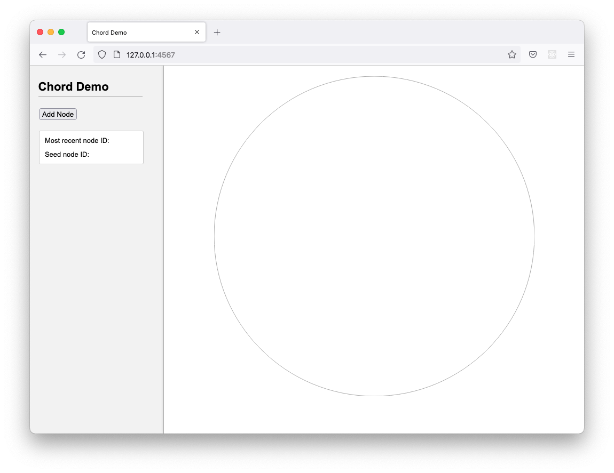
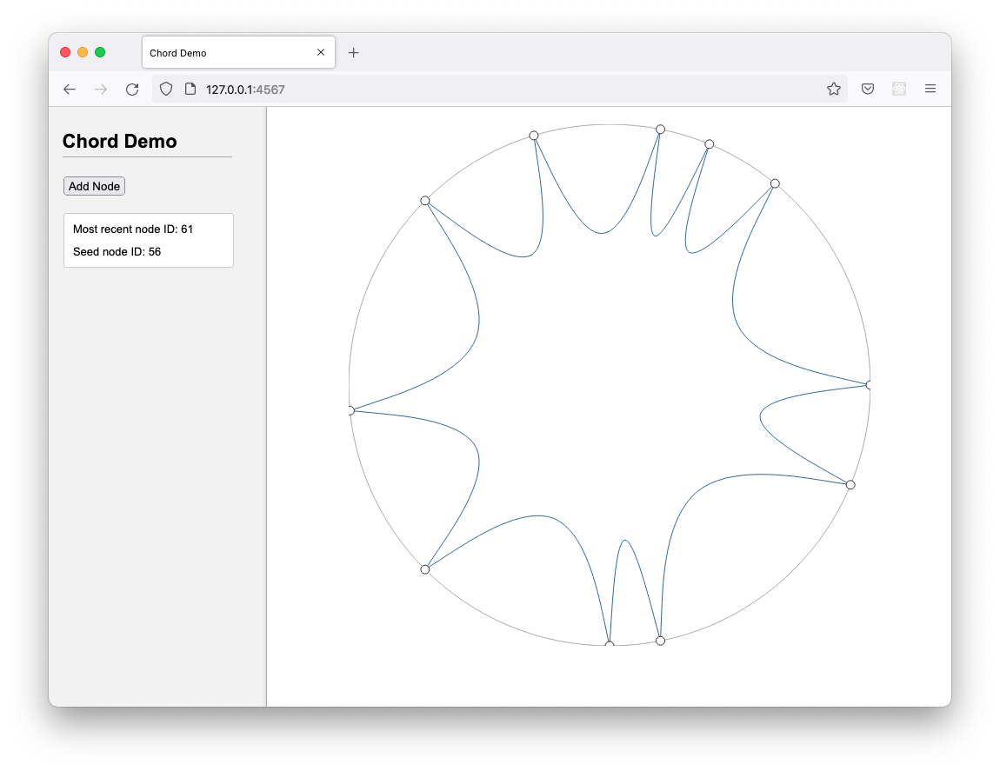

# Chordial

This project aims to provide a simple Scala implementation of Chord, a protocol and algorithm for a peer-to-peer distributed hash table.

It is intended for education purposes, and to better understand the Scala ecosystem.

## Modules

This repo currently contains the following modules:

* _core_ - core classes and algorithms that make up the Chord implementation
* _demo_ - a simple websocket-based demo, which allows a Chord network to be visualised on a ring
* _dht_ - a minimal Distributed Hash Table (DHT) based on the classes provided by _core_

### Core

The _core_ module is being developed as a reusable Chord library, responsible for maintaining a node's location within a Chord overlay network. This approach, which is based on the protocol described in the [Chord paper](https://pdos.csail.mit.edu/papers/ton:chord/paper-ton.pdf), allows the Chord network overlay layer to function independently of application-layer concerns such as replication.

### Demo

The _demo_ module is a single server demo application that can be used to experiment with Chord's network overlay concepts. It provides an RESTful interface for creating nodes, and a browser-based frontend for visualising a Chord ring.

### DHT

The _dht_ module implements a simple distributed hash table based on Chord. _Note: This is a work in progress_.

## Running the Demo

To start the demo server using SBT:

    sbt "demo/runMain com.tristanpenman.chordial.demo.Demo"

Once the server has started, the browser-based interface should be accessible via [http://127.0.0.1:4567](http://127.0.0.1:4567). This page opens a WebSocket connection to the server, and will be updated with nodes and lines representing their successor relationships as they are added to the network. 

Initially, the network will be empty:

You can click the 'Add Node' button to add new nodes to network.

Alternatively, nodes can be created via POST requests to the `http://127.0.0.1:4567/nodes` endpoint. Using cURL, you could create a new node like so:

    curl -XPOST -w"\n" http://127.0.0.1:4567/nodes
 
This would create a new seed node. The response will contain a JSON representation of the new node:

    {"nodeId":6,"successorId":6,"active":true}
 
Although this demo allows you to create multiple independent Chord networks within the same keyspace, you will generally want to create nodes that join an existing network. To create a node that is connected to an existing network, you can specify an existing node as a seed ID. For example: 

    curl -XPOST -w"\n" http://127.0.0.1:4567/nodes?seed_id=6

After several node insertions, you will end up with a visualisation similar to this:

    
The list of all existing nodes can be retrieved via a GET request:

    curl -XGET -w"\n" http://127.0.0.1:4567/nodes
    
This will return a JSON array, where each element represents a node:
    
    [{"nodeId":6,"successorId":59,"active":true}, {"nodeId":59,"successorId":6,"active":true}]

## Test Suite

Chordial includes a basic test suite (growing all the time!), which can be run via SBT:

    sbt test

## License

This project is licensed under the Simplified BSD License. See the LICENSE file for more information.
